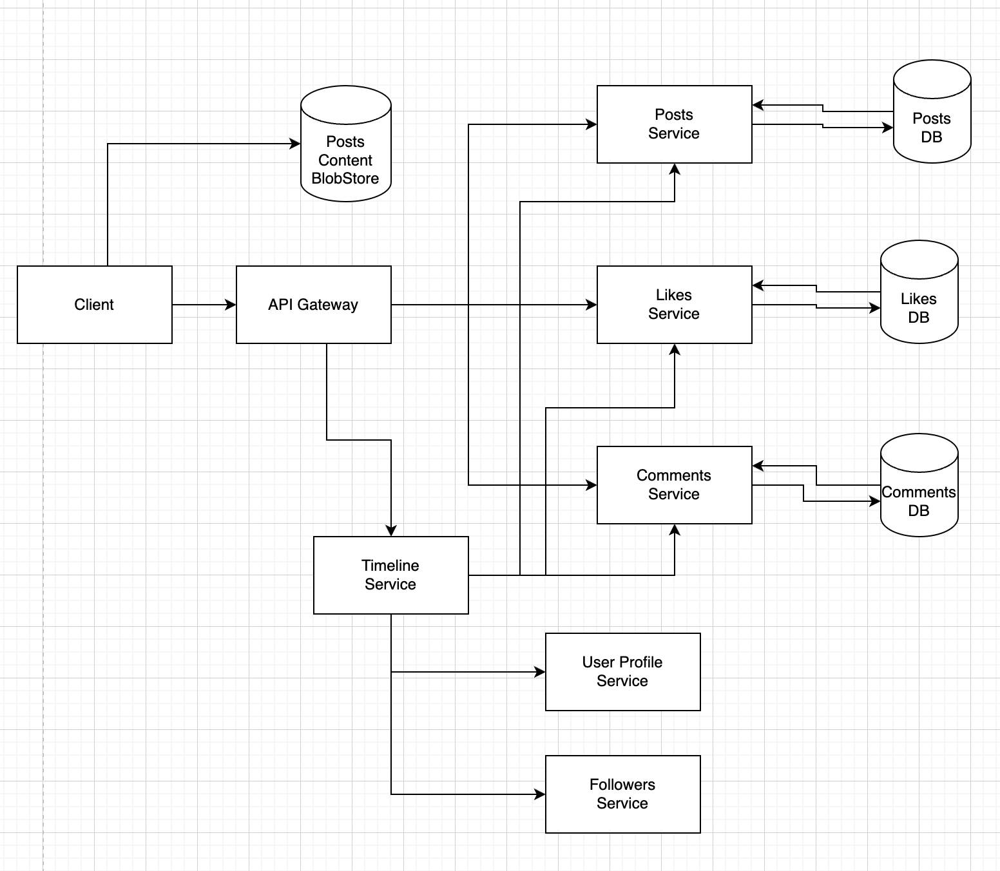
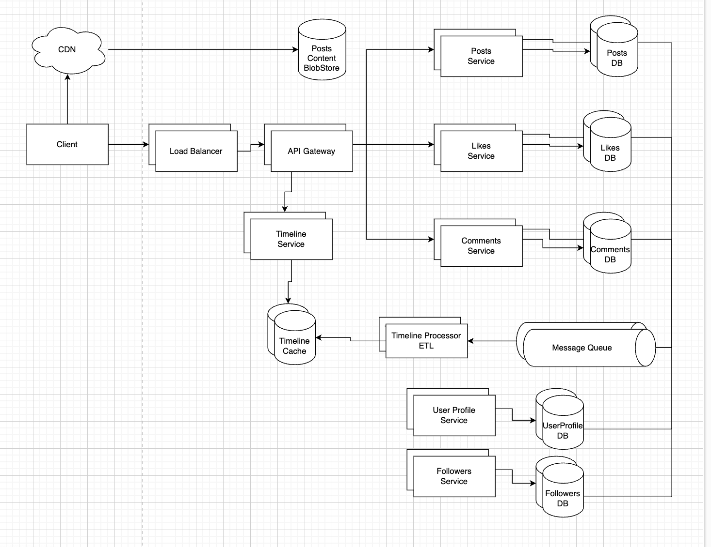

# Design Instagram

## Step 1: Outline use cases and constraints

### Use cases

#### We'll scope the problem to handle only the following use cases

* **User** views a post 
* **User** views a post and leave a **Like**
* **User** views a post and leave a **Comment**
* **User** views the news feed and can see the timeline of posts of the users he/she follows

#### Out of scope

* **User** registers for an account
    * **User** verifies email
* **User** logs in/out into a registered account
    * **User** edits a profile
* **User** can follow/unfollow other **User**
* **User** can upload a **Post**

### Constraints and assumptions

#### State assumptions

* Traffic is not evenly distributed
* Showing **Timeline** should be fast
* **Timeline** should be always available for the user, availability, and partition tolerance are important.
* Eventual consistency for a **Timeline** is okay.
* **Timeline** update should NOT be in real-time, it is okay to have a 1-5 sec delay.
* 10 million users
* 100 million writes per month (10 mil posts + 30 mil comments + 60 mil likes).
* 1000 million (1 milliard) reads per month.
* 10:1 read-to-write ratio

#### Calculate usage

* Size per Post ~ 10 Mb content per post
* Size per Like ~ uint64 + uint64 + timestamp (64+64+12) = 140 bytes ~ 0.14 Kb
* Size per Comment ~ uint64 + uint64 + timestamp + varchar(1024) = 1164 bytes ~ 1.16 Kb
* 10 Mb Post * 10 million posts         = 100 Tb posts per month
* 0.14 Kb Like * 60 million likes       = 8.4 Gb likes per month
* 1.16 Kb Comment * 30 million comments = 34.8 Gb comments per month
* Assume most are new posts instead of updates to existing ones
* 4 post writes per second on average
* 24 like writes per second on average
* 12 comment writes per second on average
* 400 read requests per second on average

## Step 2: Create a high level design

> Outline a high level design with all important components.



## Step 3: Design core components

### Use case: User views timeline

The `Posts` table could have the following structure:

```
id uint64 NOT NULL serial
user_id uint64 NOT NULL
description varchar(1024) DEFAULT NULL
created_at datetime NOT NULL
updated_at datetime
PRIMARY KEY(id)
```
To be able to query user posts by user we need a B-tree index on (user_id) column

The `Comments` table could have the following structure:

```
id uint64 NOT NULL serial
post_id uint64 NOT NULL
user_id uint64 NOT NULL
comment varchar(1024) NOT NULL
created_at datetime NOT NULL
updated_at datetime
PRIMARY KEY(id)
```
To be able to query comments by post we need a B-tree index on (post_id) column
To be able to sort posts by created_at we need a B-tree index on (created_at) column

The `Likes` table could have the following structure:

```
user_id uint64 NOT NULL
post_id uint64 NOT NULL
created_at datetime NOT NULL
PRIMARY KEY(user_id,post_id)
```
To be able to query likes by post we need a B-tree index on (post_id) column

The `Follows` table could have the following structure:

```
followee_id uint64 NOT NULL
follower_id uint64 NOT NULL
created_at datetime NOT NULL
PRIMARY KEY(follower_id,follower_id)
```

To be able to query followees of a user we need a B-tree index on (follower_id) column
To be able to query followers of a user we need a B-tree index on (followee_id) column

To be able to generate a timeline we need to do next steps:
Current user id = 111;
1) Followees => `SELECT * FROM follows WHERE follower_id = 111`
2) Followees user profiles => `SELECT * FROM user_profile WHERE user_id in (followees_ids)`
3) Followees resent Posts => `SELECT * FROM posts WHERE user_id in (followees_ids) ORDER BY created_at DESC LIMIT 20`
4) Posts likes => `SELECT post_id, count(*) FROM likes WHERE post_id in (followees_posts_ids)`
6) Aggregate result

## Step 4: Scale the design

> Identify and address bottlenecks, given the constraints.



**Important: Do not simply jump right into the final design from the initial design!**

State you would do this iteratively: 1) **Benchmark/Load Test**, 2) **Profile** for bottlenecks 3) address bottlenecks while evaluating alternatives and trade-offs, and 4) repeat.  See [Design a system that scales to millions of users on AWS](../scaling_aws/README.md) as a sample on how to iteratively scale the initial design.

It's important to discuss what bottlenecks you might encounter with the initial design and how you might address each of them.  For example, what issues are addressed by adding a **Load Balancer** with multiple **Web Servers**?  **CDN**?  **Master-Slave Replicas**?  What are the alternatives and **Trade-Offs** for each?

We'll introduce some components to complete the design and to address scalability issues.  Internal load balancers are not shown to reduce clutter.

*To avoid repeating discussions*, refer to the following [system design topics](https://github.com/donnemartin/system-design-primer#index-of-system-design-topics) for main talking points, tradeoffs, and alternatives:

* [DNS](https://github.com/donnemartin/system-design-primer#domain-name-system)
* [CDN](https://github.com/donnemartin/system-design-primer#content-delivery-network)
* [Load balancer](https://github.com/donnemartin/system-design-primer#load-balancer)
* [Horizontal scaling](https://github.com/donnemartin/system-design-primer#horizontal-scaling)
* [Web server (reverse proxy)](https://github.com/donnemartin/system-design-primer#reverse-proxy-web-server)
* [API server (application layer)](https://github.com/donnemartin/system-design-primer#application-layer)
* [Cache](https://github.com/donnemartin/system-design-primer#cache)
* [Relational database management system (RDBMS)](https://github.com/donnemartin/system-design-primer#relational-database-management-system-rdbms)
* [SQL write master-slave failover](https://github.com/donnemartin/system-design-primer#fail-over)
* [Master-slave replication](https://github.com/donnemartin/system-design-primer#master-slave-replication)
* [Consistency patterns](https://github.com/donnemartin/system-design-primer#consistency-patterns)
* [Availability patterns](https://github.com/donnemartin/system-design-primer#availability-patterns)

The **Analytics Database** could use a data warehousing solution such as Amazon Redshift or Google BigQuery.

An **Object Store** such as Amazon S3 can comfortably handle the constraint of 12.7 GB of new content per month.

To address the 40 *average* read requests per second (higher at peak), traffic for popular content should be handled by the **Memory Cache** instead of the database.  The **Memory Cache** is also useful for handling the unevenly distributed traffic and traffic spikes.  The **SQL Read Replicas** should be able to handle the cache misses, as long as the replicas are not bogged down with replicating writes.

4 *average* paste writes per second (with higher at peak) should be do-able for a single **SQL Write Master-Slave**.  Otherwise, we'll need to employ additional SQL scaling patterns:

* [Federation](https://github.com/donnemartin/system-design-primer#federation)
* [Sharding](https://github.com/donnemartin/system-design-primer#sharding)
* [Denormalization](https://github.com/donnemartin/system-design-primer#denormalization)
* [SQL Tuning](https://github.com/donnemartin/system-design-primer#sql-tuning)

We should also consider moving some data to a **NoSQL Database**.

## Additional talking points

> Additional topics to dive into, depending on the problem scope and time remaining.

#### NoSQL

* [Key-value store](https://github.com/donnemartin/system-design-primer#key-value-store)
* [Document store](https://github.com/donnemartin/system-design-primer#document-store)
* [Wide column store](https://github.com/donnemartin/system-design-primer#wide-column-store)
* [Graph database](https://github.com/donnemartin/system-design-primer#graph-database)
* [SQL vs NoSQL](https://github.com/donnemartin/system-design-primer#sql-or-nosql)

### Caching

* Where to cache
    * [Client caching](https://github.com/donnemartin/system-design-primer#client-caching)
    * [CDN caching](https://github.com/donnemartin/system-design-primer#cdn-caching)
    * [Web server caching](https://github.com/donnemartin/system-design-primer#web-server-caching)
    * [Database caching](https://github.com/donnemartin/system-design-primer#database-caching)
    * [Application caching](https://github.com/donnemartin/system-design-primer#application-caching)
* What to cache
    * [Caching at the database query level](https://github.com/donnemartin/system-design-primer#caching-at-the-database-query-level)
    * [Caching at the object level](https://github.com/donnemartin/system-design-primer#caching-at-the-object-level)
* When to update the cache
    * [Cache-aside](https://github.com/donnemartin/system-design-primer#cache-aside)
    * [Write-through](https://github.com/donnemartin/system-design-primer#write-through)
    * [Write-behind (write-back)](https://github.com/donnemartin/system-design-primer#write-behind-write-back)
    * [Refresh ahead](https://github.com/donnemartin/system-design-primer#refresh-ahead)

### Asynchronism and microservices

* [Message queues](https://github.com/donnemartin/system-design-primer#message-queues)
* [Task queues](https://github.com/donnemartin/system-design-primer#task-queues)
* [Back pressure](https://github.com/donnemartin/system-design-primer#back-pressure)
* [Microservices](https://github.com/donnemartin/system-design-primer#microservices)

### Communications

* Discuss tradeoffs:
    * External communication with clients - [HTTP APIs following REST](https://github.com/donnemartin/system-design-primer#representational-state-transfer-rest)
    * Internal communications - [RPC](https://github.com/donnemartin/system-design-primer#remote-procedure-call-rpc)
* [Service discovery](https://github.com/donnemartin/system-design-primer#service-discovery)

### Security

Refer to the [security section](https://github.com/donnemartin/system-design-primer#security).

### Latency numbers

See [Latency numbers every programmer should know](https://github.com/donnemartin/system-design-primer#latency-numbers-every-programmer-should-know).

### Ongoing

* Continue benchmarking and monitoring your system to address bottlenecks as they come up
* Scaling is an iterative process
